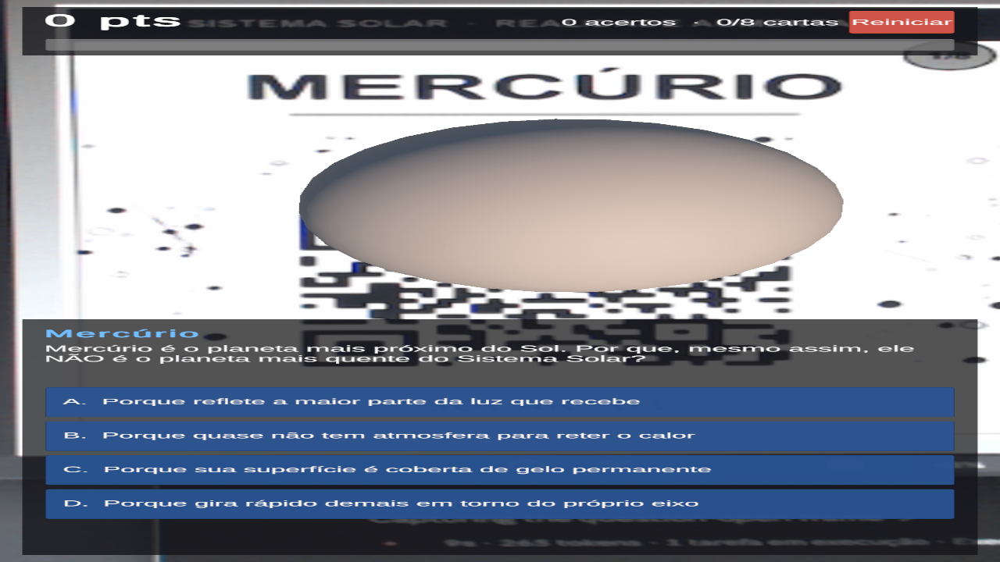
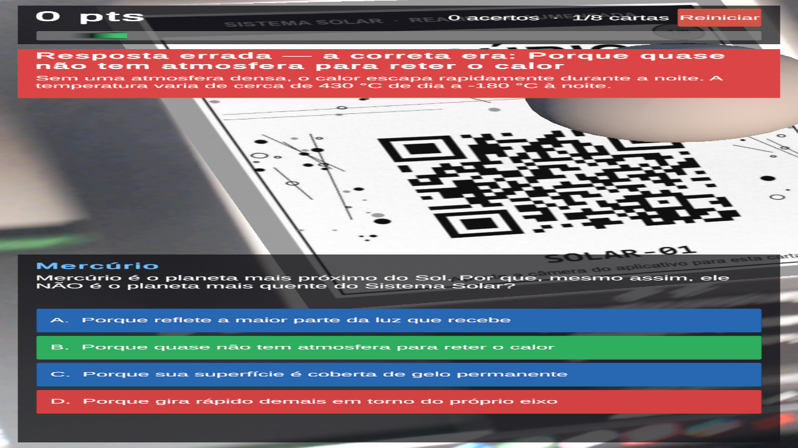

# AR Quiz QR — Jogo Educacional em Realidade Aumentada

Projeto da disciplina **CIC904 — Multimídia e Realidade Virtual** (Prof. Isaac).

Jogo educacional de perguntas e respostas em Realidade Aumentada. Ao apontar a
câmera para uma carta impressa com QR Code, o aplicativo reconhece o marcador,
exibe um objeto virtual 3D sobre a carta e abre uma pergunta sobre o tema. O
jogador responde tocando em uma das alternativas na tela, recebe o retorno de
acerto ou erro com uma explicação, e acumula pontos ao longo das 8 cartas.

**Tema do conteúdo:** Sistema Solar.



*Carta impressa reconhecida pela webcam: o planeta em 3D flutua sobre o
marcador e a pergunta correspondente abre na tela.*



*Resposta errada: a alternativa escolhida fica vermelha, a correta é destacada
em verde e a faixa superior traz a explicação do conteúdo.*

---

## Funcionalidades

- **Reconhecimento de marcadores** — 8 cartas impressas rastreadas pela Vuforia
  Engine, cada uma ligada a uma pergunta diferente.
- **Objeto virtual sobre a carta** — um planeta 3D que gira e flutua enquanto o
  marcador está em vista, e some quando a carta sai do campo de visão.
- **Quiz com 4 alternativas** — enunciado e opções montados em tempo de
  execução a partir de um arquivo de dados, sem nada escrito na cena.
- **Alternativas embaralhadas de forma determinística** — a ordem muda de
  pergunta para pergunta (o jogador não decora a posição da resposta), mas
  permanece a mesma quando a carta sai e volta ao campo de visão.
- **Retorno imediato** — a alternativa escolhida fica verde ou vermelha, a
  correta é destacada, e uma faixa mostra a explicação do conteúdo.
- **Pontuação e progresso** — 10 pontos por acerto, com contagem de acertos,
  cartas respondidas e barra de progresso.
- **Proteção contra repontuação** — reapontar a câmera para uma carta já
  respondida mostra o gabarito em vez de somar pontos de novo.
- **Reiniciar** — zera o progresso sem recarregar a cena.
- **Gerador de cartas próprio** — script em Python que codifica os QR Codes do
  zero e monta as cartas prontas para impressão.

---

## Tecnologias utilizadas

| Camada | Tecnologia |
|---|---|
| Motor | Unity 6 LTS (`6000.0.x`), Universal Render Pipeline |
| Realidade Aumentada | Vuforia Engine — *Image Targets* (rastreamento por marcador) |
| Linguagem do jogo | C# |
| Interface | Unity UI (uGUI) + TextMeshPro |
| Dados | JSON lido com `JsonUtility` a partir de `Assets/Resources` |
| Geração das cartas | Python 3 + Pillow, com codificador de QR Code próprio |
| Build Android | Android Build Support + `bundletool` |

### Sobre o codificador de QR Code

O arquivo [`tools/qrgen.py`](tools/qrgen.py) implementa a codificação de QR Code
**em Python puro, sem bibliotecas externas**: campo de Galois GF(256),
correção de erro Reed–Solomon, construção da matriz com os padrões de
localização, alinhamento e tempo, avaliação das 8 máscaras pelas quatro regras
de penalidade do padrão, e a informação de formato com BCH(15,5).

A verificação está em [`tools/teste_qrgen.py`](tools/teste_qrgen.py), que
decodifica a matriz gerada e compara com o texto de entrada:

```bash
cd tools
python teste_qrgen.py
```

---

## Como as peças conversam

```
  Carta impressa                Vuforia Engine
  (QR + arte única)  ──────>  reconhece o Image Target
                                      │
                                      ▼
                            MarcadorPergunta.cs
                       (lê o nome do target: "SOLAR-03")
                                      │
                                      ▼
                              QuizManager.cs
                   procura a pergunta no perguntas.json
                                      │
                    ┌─────────────────┼─────────────────┐
                    ▼                 ▼                 ▼
             PainelQuiz.cs   PainelFeedback.cs   HudPontuacao.cs
```

A comunicação entre o `QuizManager` e a interface acontece por **eventos
estáticos** (`event Action`), o mesmo padrão apresentado na Aula 04. O
`QuizManager` não guarda referência a nenhum objeto de UI, e os scripts de UI
não procuram o `QuizManager` na cena — cada um apenas assina os eventos que lhe
interessam em `OnEnable` e cancela a assinatura em `OnDisable`.

O nome do Image Target na Vuforia é a chave que liga o mundo físico ao banco de
perguntas: o target `SOLAR-03` encontra a pergunta de `id` `SOLAR-03`. Por isso
dá para acrescentar perguntas sem tocar em nenhuma linha de C#.

---

## Estrutura do repositório

```
├── UnityAssets/
│   ├── Scripts/
│   │   ├── Data/Pergunta.cs            modelo de dados do JSON
│   │   ├── Core/QuizManager.cs         regras do jogo, pontuação e eventos
│   │   ├── AR/MarcadorPergunta.cs      ponte entre a Vuforia e o jogo
│   │   ├── AR/GiroObjeto.cs            animação do objeto 3D
│   │   └── UI/                         painel do quiz, feedback e HUD
│   └── Resources/perguntas.json        banco de perguntas
├── tools/
│   ├── qrgen.py                        codificador de QR Code
│   ├── teste_qrgen.py                  verificação por round-trip
│   └── gerar_cartas.py                 monta as cartas imprimíveis
├── cartas/                             PNGs prontos para imprimir e para a Vuforia
└── docs/PASSO_A_PASSO.md               montagem do projeto na Unity
```

---

## Dependências, versões e build

### Requisitos

- **Unity 6 LTS**, linha `6000.0.x` (mínimo `6000.0.38f1`, conforme a tabela
  de compatibilidade da Vuforia)
- **Android Build Support** (SDK + NDK + JDK) — apenas para gerar o APK
- **Vuforia Engine** — https://developer.vuforia.com/downloads/sdk
- Conta gratuita na Vuforia (para a *App License Key* e o *Target Manager*)
- **Python 3** com **Pillow** — apenas para regerar as cartas
- **Java** + **bundletool** — apenas para gerar o APK

### Montagem do projeto

O roteiro completo, do projeto vazio até o APK, está em
**[`docs/PASSO_A_PASSO.md`](docs/PASSO_A_PASSO.md)**.

Resumo:

1. Projeto Unity **Universal 3D** → `Build Profiles` → **Android** → *Switch Platform*
2. Importar o `.unitypackage` da Vuforia Engine
3. Colar a *App License Key* em `Window → Vuforia Configuration`
4. Criar o database `QuizSistemaSolar` no *Target Manager* e subir os PNGs de
   `cartas/`, **nomeando cada alvo exatamente como o `id` do JSON** (`SOLAR-01`…)
5. Copiar `UnityAssets/Scripts` e `UnityAssets/Resources` para `Assets/`
6. Montar a cena: `AR Camera`, os 8 `Image Target` e o `QuizManager`
7. `File → Build Profiles` → **Build App Bundle** → **Build**

### Do `.aab` para o APK

```bash
java -jar bundletool.jar build-apks --bundle=ARQuizQR.aab --output=ARQuizQR.apks --mode=universal
```

Depois descompacte o `.apks` como um `.zip` e instale o `universal.apk` no celular.

### Regerar as cartas

Para trocar o tema ou acrescentar perguntas, edite
`UnityAssets/Resources/perguntas.json` e rode:

```bash
cd tools
python gerar_cartas.py
```

Os PNGs individuais vão para o *Target Manager* da Vuforia; as folhas A4
(`folha_impressao_*.png`) são para imprimir e usar no jogo.

---

## Por que existem duas versões das cartas

A Vuforia rastreia por **pontos de característica naturais** da imagem — ela
nunca decodifica o QR — e trabalha em **tons de cinza**. Isso importou mais do
que parecia.

### O problema da primeira versão

As cartas da v1 (`cartas/`) tiveram 5 estrelas no *Target Manager*, mas no teste
com as oito cartas a Vuforia reconhecia **várias ao mesmo tempo sobre uma única
carta física** — com Vênus na frente da câmera, relatava Vênus, Marte, Saturno e
Urano no mesmo segundo. As 5 estrelas medem se **cada imagem sozinha** tem pontos
suficientes, não se ela se **distingue das outras** do mesmo database.

Para investigar, [`tools/comparar_cartas.py`](tools/comparar_cartas.py) aproxima o
que um rastreador faz: detecta cantos (Harris), descreve a vizinhança de cada um,
casa os descritores entre duas cartas (teste de razão de Lowe) e mede que fração
dos pontos encontra par. A medição reproduziu o teste real e revelou três grupos
de cartas quase indistinguíveis — e cada grupo era formado pelas cartas cujo QR
tinha a **mesma máscara**:

| Máscara do QR | Cartas | No teste real |
|---|---|---|
| 1 | Vênus, Marte, Saturno, Urano | detectadas juntas |
| 6 | Terra, Júpiter | Júpiter lido como Terra |
| 4 | Mercúrio, Netuno | — |

O QR era a maior região da carta e a mais rica em pontos. A máscara é o que
define a aparência do miolo do código, e como `SOLAR-01` e `SOLAR-08` diferem num
único caractere, dois QRs com a mesma máscara saíam praticamente idênticos. A
moldura colorida, que deveria diferenciar as cartas, não contribuía nada: a cor é
descartada antes da detecção.

### A segunda versão

As cartas da v2 (`cartas/v2/`, geradas por
[`tools/gerar_cartas_v2.py`](tools/gerar_cartas_v2.py)):

- usam **uma máscara diferente por carta** — o padrão QR tem exatamente 8 máscaras,
  e o jogo tem exatamente 8 planetas. Qualquer máscara é válida: o leitor
  identifica qual foi usada pela informação de formato gravada no código;
- têm o QR **menor**, num canto, para ele deixar de dominar a carta;
- não têm cabeçalho nem rodapé, que eram idênticos nas oito;
- são cobertas por um **mapa estelar denso e único**, gerado a partir do `id`.

| | v1 | v2 |
|---|---|---|
| Carta × ela mesma, vista pela câmera | 67% | 78% |
| Pior par entre cartas diferentes | 66% | 34% |
| **Margem** | **1 ponto** | **44 pontos** |

Na v1, uma carta se parecia tanto com outra quanto com ela mesma. Na v2, cada
carta se parece mais que o dobro consigo mesma do que com qualquer outra.

> A medição é uma aproximação do princípio da Vuforia, cujo algoritmo é
> proprietário — serve para **comparar versões**, não como previsão exata. A
> prova definitiva é o teste com as cartas impressas.

